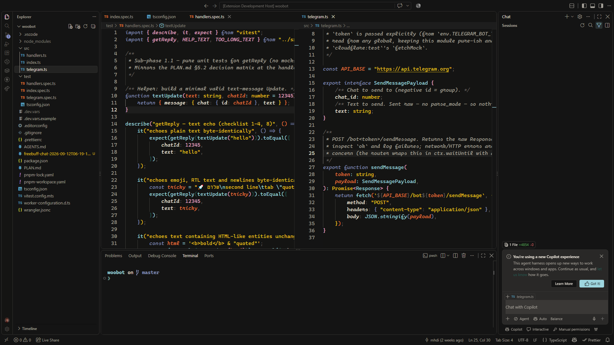

# Codepedia Dark Theme

A dark theme for Visual Studio Code, designed to be comfortable during long coding sessions.

| Specification | Details |
| --- | --- |
| Theme name | `codepdia` |
| Type | Dark (`vs-dark`) |
| Version | `2.3.0` |
| Font | Monaspace |
| Icon theme | Chalice Icon Theme |

## Color Palette

| Color | Hex |
| --- | --- |
| Muted Black | `#1D1D1B` |
| Seashell | `#EAE4DA` |
| Lavender | `#808CB5` |
| Tea | `#245E55` |
| Mustard Yellow | `#EAC119` |
| Pink Quartz | `#EAA7C7` |
| Sky | `#9ED6DF` |
| Tangerine | `#ED773C` |
| Red Passion | `#C63F3E` |

We are actively developing this theme. Contributions are welcome; feel free to open a pull request.
